  

<h1 align="center">Hi, I'm Carlos</h1>

  I build software systems with a strong interest in backend engineering, product architecture, and real-world platforms.

  
  

---

## About me

- Focused on backend and full-stack development
- Interested in scalable products, legal tech, and structured systems
- Building projects that feel real, useful, and maintainable
- Working from Mexico City

## Tech I work with

  
  
  
  
  
  
  

---

## Currently building

### Granate
A legal operations platform for law firms and legal teams, designed around domain separation, internal operations, authentication, and long-term scalability.

### Also exploring
- cleaner backend architecture
- deployment and staging workflows
- better product thinking for real software

---

## Featured projects

### Granate
Legal management platform focused on cases, documents, tasks, users, and internal processes.

### Pet Adoption Frontend
Frontend for a pet adoption system built with HTML, CSS, and JavaScript, integrated with a Spring Boot + Kotlin backend.

### KA Tracker Goals
Habit tracking app with a modern React / Next.js style stack focused on interaction flows and personal productivity.

---

## Journey

**Past**  
I started building academic and personal projects while getting more comfortable with structured development workflows.

**Present**  
Right now I'm focused on turning projects into systems that look closer to real products, especially around backend, architecture, and operations.

**Future**  
I want to keep building stronger product-oriented systems and push further into scalable backend and platform design.

---

## GitHub stats

  
  

---

## Pinned repositories

- `granate-platform`
- `adopcion-ids-equipo7-frontend`
- `KA_tracker_goals`
- `documento-proyecto01-ldp`
